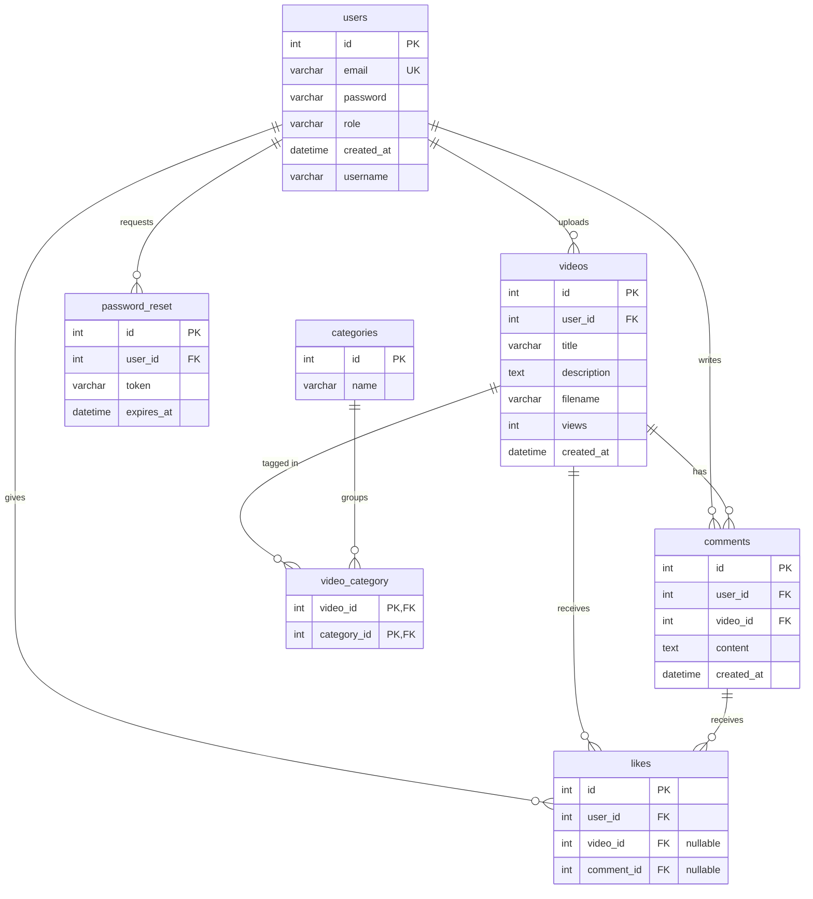
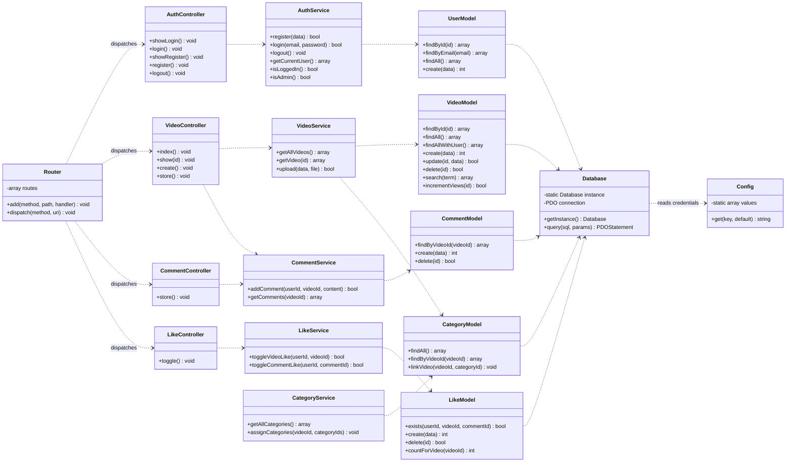

# StreamHive

StreamHive is a "YouTube-light" video platform built as an individual MBO-4
school assignment (mboRijnland, year 2). Users can register, log in, upload
videos, watch them, comment, and like. It is written in plain **PHP (OOP, with
a light MVC structure)** and uses **MySQL through PDO** with prepared
statements only — no frameworks and no extra libraries.

This project is built in weekly phases that follow the official study guide.
The README grows with the project; this version covers the **Week 1**
deliverables: architecture, ERD, class diagram and the project skeleton.

---

## Tech stack

| Concern            | Choice                                             |
| ------------------ | -------------------------------------------------- |
| Language           | PHP 8 (OOP, light MVC)                              |
| Database           | MySQL, accessed through **PDO + prepared statements** |
| Local environment  | Docker (PHP-FPM + Nginx), see `docker/`            |
| Configuration      | `.env` file, loaded by a small `Config` class      |
| Version control    | Git (real commits per weekly phase)                |

---

## Project structure

```
/streamhive
├── /app
│   ├── /models         # UserModel, VideoModel, CommentModel, LikeModel, CategoryModel
│   ├── /controllers    # AuthController, VideoController, CommentController, LikeController
│   └── /services       # AuthService, VideoService, CommentService, LikeService, CategoryService
├── /core
│   ├── Database.php     # PDO wrapper (singleton)
│   └── Router.php       # Maps a request to a controller action
├── /config
│   └── Config.php       # Reads the .env file
├── /views              # HTML templates (output only, no SQL, no logic)
│   ├── /partials       # Shared header / footer
│   ├── /auth           # login / register views (added in Week 3)
│   └── /videos         # video overview / detail / upload views (added in Week 4)
├── /public             # Web root (document root for Nginx)
│   ├── index.php       # Front controller / entry point
│   └── /uploads        # Uploaded video files (git-ignored)
├── /database           # schema.sql with the full schema + dummy data (added in Week 2)
├── /docker             # Local PHP-FPM + Nginx development environment
├── .env                # Real credentials (never committed)
├── .env.example        # Template with placeholder values
├── .gitignore
└── README.md
```

> `database/schema.sql` contains the full schema **and** the dummy data, so the
> database can be recreated from a single file.

---

## Architecture: layers and responsibilities

StreamHive uses a strict separation of concerns. A request flows in one
direction through the layers:

```
Request → Controller → Service → Model → Database (PDO)
                                            │
                                       MySQL tables
Response ← View  ◄───────────────────────────
```

| Layer          | Responsibility                                                              |
| -------------- | -------------------------------------------------------------------------- |
| **Controller** | Handles the HTTP request, reads input, calls a service. **No SQL.**        |
| **Service**    | Business logic and validation. Decides *what* should happen.               |
| **Model**      | The **only** layer that talks to the database, through PDO.                 |
| **View**       | HTML output only, with minimal `<?php ?>` and always `htmlspecialchars()`. |
| **Core**       | `Database` (shared PDO connection) and `Router` support all of the above.  |

---

## ERD (Entity Relationship Diagram)

This diagram matches the database schema exactly (see `database/schema.sql`).



A **like** belongs to a user and points to *either* a video *or* a comment
(both foreign keys are nullable). The **video_category** table is a junction
table that resolves the many-to-many relationship between videos and
categories; its primary key is the combination of both foreign keys.

---

## Class diagram

The diagram below shows the planned OOP structure (core, models, services and
controllers) and how the layers depend on each other. In Week 1 the core
classes exist as skeletons; the rest are filled in during later weeks.



---

## How the database maps to the classes

Each **model** is responsible for exactly one table (and, where needed, the
join table that belongs to it). The model is the only place where SQL is
written.

| Model           | Table(s)                          | Notes                                                              |
| --------------- | --------------------------------- | ----------------------------------------------------------------- |
| `UserModel`     | `users`                           | Accounts, login lookup by email, role (`user` / `admin`).         |
| `VideoModel`    | `videos`                          | CRUD, search, view counter, and a JOIN to `users` for the uploader name. |
| `CommentModel`  | `comments`                        | Comments per video, JOIN to `users` to show the author's name.    |
| `LikeModel`     | `likes`                           | Likes on a video *or* a comment; prevents duplicate likes.        |
| `CategoryModel` | `categories`, `video_category`    | Categories and the many-to-many link to videos.                   |
| *(AuthService)* | `password_reset`                  | Reset tokens are handled by the auth layer (Week 6).              |

The **services** combine one or more models with business rules (for example
`AuthService` hashes passwords and manages the session), and the
**controllers** translate an HTTP request into a service call and pick the
right view to render.

---

## Local development

The repository ships with a Docker setup (PHP-FPM + Nginx). The web root is
`public/`, so `public/index.php` is the entry point.

```bash
# 1. Copy the env template and fill in your database credentials
cp .env.example .env

# 2. Start the containers (from the docker/ folder)
docker compose -f docker/docker-compose.yaml up --build

# 3. Open the app
#    http://localhost:8888
```

In Week 1 the app shows a "Hello StreamHive" placeholder page to prove the
structure and the shared header/footer includes work.

---

## Build roadmap (weekly phases)

| Week | Focus                                                             |
| ---- | ---------------------------------------------------------------- |
| 1    | Architecture, ERD, class diagram, project skeleton **(this README)** |
| 2    | Database + PDO wrapper + `UserModel` and `VideoModel`            |
| 3    | Authentication: register, login, sessions, roles                |
| 4    | Video CRUD + upload, overview with a `videos` ⨝ `users` JOIN    |
| 5    | Comments (with JOIN) and likes (toggle, no duplicates)          |
| 6    | Advanced features: search, categories, view counter, password recovery |
| 7    | Testing, cleanup, and final documentation                       |
