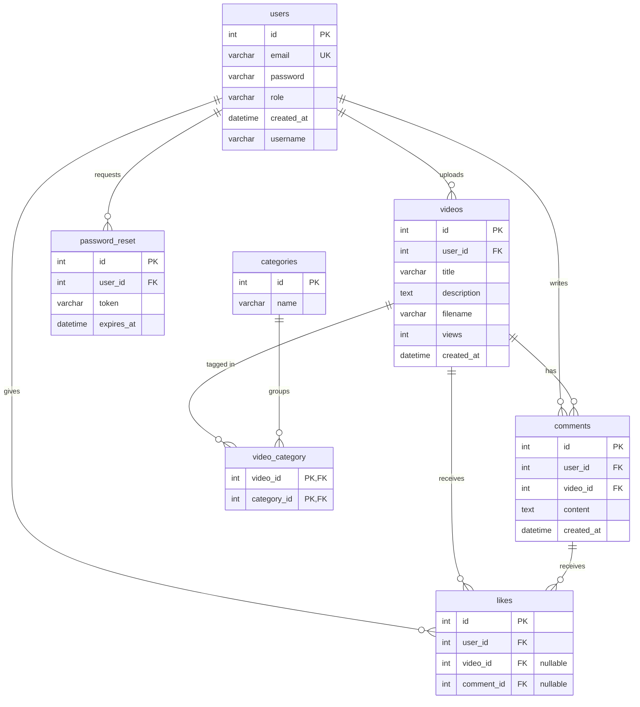
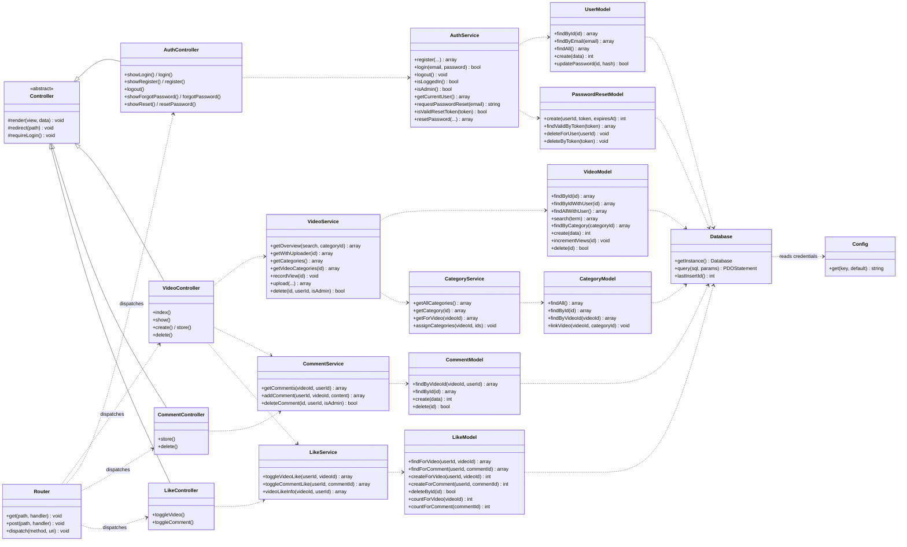

# StreamHive

StreamHive is a "YouTube-light" video platform built as an individual MBO-4
school assignment (mboRijnland, year 2). It is written in plain **PHP (OOP, with
a light MVC structure)** and uses **MySQL through PDO** with prepared statements
only — no frameworks and no extra libraries.

**Features**

- Register, log in and log out (hashed passwords, sessions, `user` / `admin` roles)
- Upload videos (file stored on disk), watch them, and delete your own
- A video overview with the uploader's name (via a JOIN)
- Comments on videos (with the author's name, via a JOIN)
- Likes on videos *and* comments, with toggle behaviour and no duplicates
- Search videos by title/description
- Categories (many-to-many) with filtering
- A view counter per video
- Password recovery with a time-limited reset token

---

## Tech stack

| Concern            | Choice                                                |
| ------------------ | ----------------------------------------------------- |
| Language           | PHP 8 (OOP, light MVC)                                |
| Database           | MySQL, accessed through **PDO + prepared statements** |
| Local environment  | Docker (PHP-FPM + Nginx), see `docker/`               |
| Configuration      | `.env` file, loaded by a small `Config` class         |
| Version control    | Git (real commits per weekly phase)                   |

---

## Project structure

```
/streamhive
├── /app
│   ├── /models         # UserModel, VideoModel, CommentModel, LikeModel,
│   │                   #   CategoryModel, PasswordResetModel
│   ├── /controllers    # AuthController, VideoController, CommentController,
│   │                   #   LikeController
│   └── /services       # AuthService, VideoService, CommentService,
│                       #   LikeService, CategoryService
├── /core
│   ├── Database.php     # PDO wrapper (singleton)
│   ├── Router.php       # Maps a request to a controller action
│   └── Controller.php   # Base controller: render(), redirect(), requireLogin()
├── /config
│   └── Config.php       # Reads the .env file
├── /views              # HTML templates (output only, no SQL, no logic)
│   ├── /partials       # Shared header / footer
│   ├── /auth           # login, register, forgot, reset
│   └── /videos         # overview, detail, upload, not-found
├── /public             # Web root (document root for Nginx)
│   ├── index.php       # Front controller / entry point
│   ├── /css            # style.css
│   └── /uploads        # Uploaded video files (git-ignored)
├── /database
│   ├── schema.sql          # Full schema + dummy data
│   └── connection_test.php # Week 2 proof script (SELECT + INSERT via the models)
├── /docker             # Local PHP-FPM + Nginx development environment
├── .env                # Real credentials (never committed)
├── .env.example        # Template with placeholder values
├── .gitignore
└── README.md
```

> `database/schema.sql` contains the full schema **and** the dummy data, so the
> database can be recreated from a single file.

---

## Architecture: layers and responsibilities

StreamHive uses a strict separation of concerns. A request flows in one
direction through the layers:

```
Request → Controller → Service → Model → Database (PDO)
                                            │
                                       MySQL tables
Response ← View  ◄───────────────────────────
```

| Layer          | Responsibility                                                              |
| -------------- | -------------------------------------------------------------------------- |
| **Controller** | Handles the HTTP request, reads input, calls a service. **No SQL.**        |
| **Service**    | Business logic and validation. Decides *what* should happen.               |
| **Model**      | The **only** layer that talks to the database, through PDO.                 |
| **View**       | HTML output only, with minimal `<?php ?>` and always `htmlspecialchars()`. |
| **Core**       | `Database`, `Router` and the base `Controller` support all of the above.   |

**Why this separation?**

- **One place for SQL.** Only models run queries, so every statement is a
  prepared statement and the SQL-injection surface is a single, reviewable
  layer.
- **Thin controllers.** Controllers only translate a request into a service
  call and choose a view, so they stay short and readable.
- **Rules live in services.** Validation, password hashing, the like-toggle
  rule and the upload rules sit in services, independent of how the request
  arrived, which makes them easy to reason about and reuse.
- **Dumb views.** Views only echo data (always escaped), so no business logic
  or queries can leak into a template.
- **Dependency injection.** Every service/model takes its dependency as an
  optional constructor argument (defaulting to the real implementation), so a
  test could pass in a fake. The base `Controller` centralises `render()`,
  `redirect()` and `requireLogin()` so that logic is not duplicated.

---

## ERD (Entity Relationship Diagram)

This diagram matches the database schema exactly (see `database/schema.sql`).



A **like** belongs to a user and points to *either* a video *or* a comment
(both foreign keys are nullable). The **video_category** table is a junction
table that resolves the many-to-many relationship between videos and
categories; its primary key is the combination of both foreign keys.

---

## Class diagram

This reflects the final code: the core classes, the models (the only DB layer),
the services (business logic) and the controllers (which all extend the base
`Controller`).



---

## How the database maps to the classes

Each **model** owns one table (plus the join table that belongs to it). The
model is the only place where SQL is written.

| Model                | Table(s)                       | Responsibility                                                       |
| -------------------- | ------------------------------ | ------------------------------------------------------------------- |
| `UserModel`          | `users`                        | Accounts, login lookup by email, role, password updates.            |
| `VideoModel`         | `videos`                       | CRUD, search, view counter, and JOINs to `users` for the uploader.  |
| `CommentModel`       | `comments`                     | Comments per video, JOIN to `users` for the author + like counts.   |
| `LikeModel`          | `likes`                        | Likes on a video *or* a comment; checks for duplicates.             |
| `CategoryModel`      | `categories`, `video_category` | Categories and the many-to-many link to videos.                     |
| `PasswordResetModel` | `password_reset`               | Reset tokens with an expiry time.                                   |

The **services** combine one or more models with business rules (for example
`AuthService` hashes passwords and manages the session, `LikeService` enforces
the no-duplicate rule), and the **controllers** translate an HTTP request into a
service call and pick the right view to render.

---

## Key SQL queries explained

All queries use prepared statements. The interesting ones:

- **Overview & detail JOIN** (`VideoModel::findAllWithUser`,
  `findByIdWithUser`): `videos INNER JOIN users ON users.id = videos.user_id`.
  A video only stores `user_id`, so we JOIN `users` to show the uploader's
  username. Doing it in one query avoids a separate lookup per video (no N+1).

- **Comments with author and like info** (`CommentModel::findByVideoId`): a
  JOIN to `users` for the author, plus two **correlated subqueries** in the
  SELECT list — one counts the likes on each comment, the other checks whether
  the current user already liked it. Subqueries per row are used here instead of
  a `GROUP BY` because we also need the "did *I* like this" flag; it keeps
  everything in a single query rather than one query per comment.

- **Category filter** (`VideoModel::findByCategory`): joins through the junction
  table — `videos JOIN users JOIN video_category WHERE category_id = ?` — which
  is how the many-to-many relationship is queried.

- **Search** (`VideoModel::search`):
  `WHERE title LIKE :title_term OR description LIKE :description_term`. Two
  separate placeholders are bound to the same `%term%` value, because native
  (non-emulated) prepared statements do not allow reusing one named placeholder.

- **View counter** (`VideoModel::incrementViews`):
  `UPDATE videos SET views = views + 1 WHERE id = :id`. The increment happens
  inside the database in one statement, so there is no read-then-write race.

- **No duplicate likes** (`LikeService::toggle…`): first `SELECT` the existing
  like for that `user_id` + `video_id`/`comment_id`; if it exists we `DELETE`
  it (toggle off), otherwise we `INSERT`. This guarantees a user can never have
  two likes on the same item.

- **Valid reset token** (`PasswordResetModel::findValidByToken`):
  `WHERE token = :token AND expires_at > NOW()`, so an expired token simply
  returns nothing and is rejected.

---

## Why the database is in 3NF

- **1NF — atomic values.** Every column holds a single value; there are no
  comma-separated lists. A video's categories live in their own rows in
  `video_category`, not in a column on `videos`.
- **2NF — no partial dependencies.** Every table has a single-column primary
  key (`id`) except `video_category`, whose composite key is
  (`video_id`, `category_id`). That table has no non-key columns, so no column
  can depend on only part of the key.
- **3NF — no transitive dependencies.** Non-key columns depend only on the key.
  A `video` stores `user_id` (a foreign key), **not** the uploader's username or
  email — those belong to `users`. A `comment` stores `user_id` and `video_id`,
  not the username. So a username is stored once, in `users`, and reached
  through a JOIN. This avoids duplication and update anomalies.

The relationships are expressed with foreign keys and `ON DELETE CASCADE`, so
deleting a user or a video automatically removes the dependent comments, likes
and category links.

---

## Local development

The repository ships with a Docker setup (PHP-FPM + Nginx). The web root is
`public/`, so every request is routed through `public/index.php`.

```bash
# 1. Copy the env template and fill in your database credentials
cp .env.example .env

# 2. Start the containers (from the project root)
docker compose -f docker/docker-compose.yaml up --build

# 3. Open the app
#    http://localhost:8888
```

Confirm the database connection at any time with the Week 2 proof script:

```bash
docker compose -f docker/docker-compose.yaml exec php php database/connection_test.php
```

---

## Manual test checklist (for the demo)

- [ ] Register a new account, log out, log back in.
- [ ] Upload a small `.mp4` with one or more categories; it plays on the detail page.
- [ ] The overview shows the uploader's name (JOIN) and the view count.
- [ ] Open a video twice — the view counter goes up.
- [ ] Post a comment; it shows your username (JOIN).
- [ ] Like a video and a comment; click again to remove the like (no duplicates).
- [ ] Search by a word in a title/description.
- [ ] Filter the overview by a category, and click a category tag on a video.
- [ ] Delete your own video / comment (the buttons only appear for the owner or an admin).
- [ ] "Forgot password" → open the shown reset link → set a new password → log in.

---

## Known issues & limitations

These are deliberate simplifications for a school project; good to be aware of
for the presentation:

- **Dummy logins don't work.** The users in `schema.sql` have placeholder
  passwords (`hashedpassword1`, …), not real hashes, so they cannot log in. Use
  a freshly **registered** account for the demo.
- **Dummy videos don't play.** The dummy `videos` rows point to filenames that
  are not in `public/uploads/`, so only videos you upload yourself will play.
- **Reset link is shown, not emailed** (by design — see above).
- **No CSRF tokens** on the POST forms, and "forgot password" reveals whether an
  email exists. Acceptable for this assignment's scope, but not for production.
- **View counter is naive** — it counts every page load, including refreshes and
  the owner's own visits.
- **No video editing.** Create/read/delete are implemented; there is no edit
  screen, so the unused `VideoModel::update()` method was removed in cleanup.
- **No pagination** on the overview; all videos are listed.

---

## Build roadmap (weekly phases)

| Week | Focus                                                              |
| ---- | ----------------------------------------------------------------- |
| 1    | Architecture, ERD, class diagram, project skeleton                |
| 2    | Database + PDO wrapper + `UserModel` and `VideoModel`             |
| 3    | Authentication: register, login, sessions, roles                  |
| 4    | Video CRUD + upload, overview with a `videos` ⨝ `users` JOIN     |
| 5    | Comments (with JOIN) and likes (toggle, no duplicates)            |
| 6    | Advanced features: search, categories, view counter, password recovery |
| 7    | Testing, cleanup, and final documentation                         |
